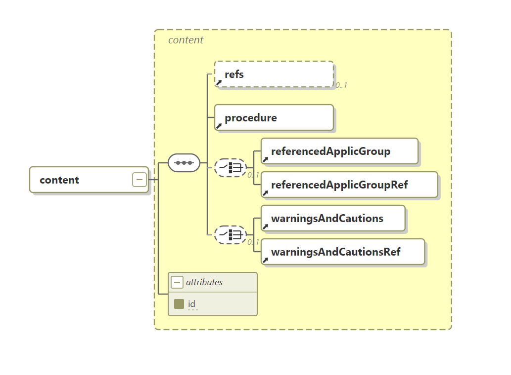

# XSD Schema Viewer

Online visualization of XSD schemas in [Altova XMLSpy](https://www.altova.com/xmlspy-xml-editor) notation.



## Features

- **GitHub URL import** — paste a link to a GitHub folder with `.xsd` files and visualize them instantly
- **File upload** — upload one or more `.xsd` files from your local disk
- **Three visualization modes**:
  - Element diagram — tree view of a specific element with children
  - Type diagram — complexType with inheritance (substitution groups)
  - Overview — all top-level elements at a glance
- **Annotations** — displayed under elements on diagrams and in a separate tab
- **Depth control** — expand 0 to 5 levels of child elements
- **Bilingual UI** — English / Russian
- **HTML documentation generator** — auto-discovers elements and annotations, supports multilingual output via `xml:lang`

## HTML Documentation

Generate standalone HTML documentation for any XSD schema:

```bash
python generate_doc.py schema.xsd -o docs/schema.html
```

If your XSD uses `xml:lang` on `xs:documentation` elements, you can select the output language:

```bash
python generate_doc.py schema.xsd --lang ru
```

```xml
<!-- Example: multilingual annotations in XSD -->
<xs:element name="Purchase">
  <xs:annotation>
    <xs:documentation xml:lang="en">A purchase transaction.</xs:documentation>
    <xs:documentation xml:lang="ru">Транзакция покупки.</xs:documentation>
  </xs:annotation>
</xs:element>
```

The language toggle in the Streamlit UI also switches diagram annotations and generated docs to the selected language.

Full options: `python generate_doc.py --help`

## Try it

[Open on Streamlit Cloud](https://xsd-viewer.streamlit.app/)

## Run locally

```bash
pip install -r requirements.txt
streamlit run app.py
```

## Core engine

The `core/` package is a standalone XSD visualization engine (pip-installable):

```bash
pip install git+https://github.com/dborozdin/xsd_viewer.git
```

```python
from core.svg_renderer import render_element_diagram
svg = render_element_diagram("schema.xsd", "MyElement", depth=2)
```

## Related

- [xsd-diagram-mcp](https://github.com/dborozdin/xsd-diagram-mcp) — MCP server for XSD visualization in Claude, Copilot, etc.

---

# Просмотр XSD-схем

Онлайн-визуализация XSD-схем в нотации [Altova XMLSpy](https://www.altova.com/xmlspy-xml-editor).


## Возможности

- **Импорт с GitHub** — вставьте ссылку на папку с `.xsd` файлами
- **Загрузка файлов** — загрузите один или несколько `.xsd` файлов с локального диска
- **Три режима визуализации**: диаграмма элемента, диаграмма типа, обзор
- **Аннотации** — отображаются на диаграммах и в отдельной вкладке
- **Глубина раскрытия** — от 0 до 5 уровней
- **Двуязычный интерфейс** — English / Русский
- **Генерация HTML-документации** — автоматическое обнаружение элементов и аннотаций, поддержка многоязычного вывода через `xml:lang`

## Генерация HTML-документации

```bash
python generate_doc.py schema.xsd -o docs/schema.html
python generate_doc.py schema.xsd --lang ru   # вывод на русском
```

Если в XSD используются теги `xml:lang` в `xs:documentation`, генератор выберет аннотации на указанном языке. Переключатель языка в интерфейсе Streamlit также влияет на язык аннотаций в диаграммах и генерируемой документации.

## Запуск локально

```bash
pip install -r requirements.txt
streamlit run app.py
```
